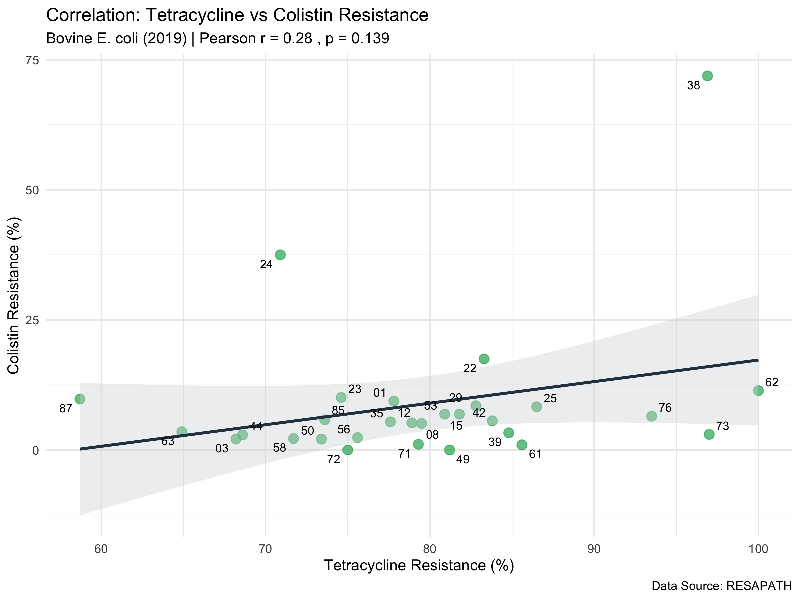

# Project：Preliminary Ecological Analysis

## Overview
This repository contains the preliminary ecological analysis for **Preliminary Ecological Analysis**. 
We investigated the potential co-selection between Colistin resistance and alternative antibiotics (TMP-SMX, Tetracycline) in bovine *E. coli* using surveillance data from the RESAPATH network (France).

## Hypothesis
We hypothesized that the use of alternative antibiotics drives the persistence of Colistin resistance through chromosomal integration of mobile genetic elements.

## Data Source
- **RESAPATH Network:** Clinical bovine *E. coli* isolates.
- **Years Analyzed:** 2024 (Current) and 2019 (Historical).
- **Level:** Departmental level (French administrative regions).

## Methodology
- Data cleaning and extraction using custom R scripts ("Surgical Extraction" method).
- Pearson correlation analysis between resistance rates of:
  - Colistin vs. TMP-SMX
  - Colistin vs. Tetracycline

## Results 
Contrary to the co-selection hypothesis, **no significant correlation** was found at the departmental level in either 2019 or 2024.

| Year | Antibiotic Pair | Pearson r | p-value | Result |
| :--- | :--- | :--- | :--- | :--- |
| **2024** | Colistin vs TMP-SMX | -0.12 | 0.52 | No Correlation |
| **2024** | Colistin vs Tetracycline | -0.26 | 0.17 | No Correlation |
| **2019** | Colistin vs TMP-SMX | 0.09 | 0.61 | No Correlation |
| **2019** | Colistin vs Tetracycline | 0.28 | 0.13 | No Correlation |

### TMP-SMX vs Colistin

### Tetracycline vs Colistin

## 1) Analysis of the relationship with TMP-SMX (trimethoprim-sulfamethoxazole)

**Characteristics**: No consistent correlation observed

2019 (r=0.1) & 2024 (r=-0.12): In both years, the absolute value of r is very small, close to zero. Furthermore, the p-values are very high (above 0.5), indicating a statistically uncorrelated relationship.

**Observations**: The use of TMP-SMX and the development of resistance to it appear to be independent phenomena from the trends in colistin resistance. There is no tendency for the resistance rates to these two agents to move in tandem within the regional resistance profiles. The consistently negligible correlation coefficients observed for TMP-SMX over the five years (from 0.1 to -0.12) confirm that colistin resistance dynamics operate independently of TMP-SMX pressure. The persistent lack of statistical significance (p>0.5) across both years strongly indicates that co-selection is not a driving factor. The high-colistin outliers (such as Departments 24 and 87 in 2024) do not correspond to elevated TMP-SMX resistance but appear at average resistance levels, further illustrating the complete decoupling of these two phenotypes.

## 2) Analysis of Relationship with Tetracycline

**Characteristics**: Reversal in correlation direction (positive to negative)

2019 (r=0.28): A slight positive correlation is observed, though not statistically significant (p>0.05). This suggests a possible tendency for colistin resistance to be slightly higher in regions with high tetracycline resistance, but the relationship is not conclusive.

2024 (r=-0.26): Conversely, a negative correlation trend is observed. While also non-significant, the regression line slopes downwards, revealing a trend diametrically opposed to 2019: regions with higher tetracycline resistance exhibit lower colistin resistance (or vice versa).

**Observations**: The reversal of the sign of r over the five years (from 0.28 to -0.26) strongly suggests that there is no direct biological or genetic linkage (co-resistance or co-selection) between these two agents, or that it is very weak. If they were strongly linked on a plasmid, the direction of the correlation should have been maintained across years. Outliers visible in the 2024 plot (Departments 24, 87, 59, etc.) are likely driving up the colistin resistance rate and significantly influencing the overall trend (r).

## Discussion 
The consistent lack of correlation in aggregated regional data empahasizes the **"Ecological Challenge"** of macroscopic surveillance. Specifically, our analysis reveals critical instability in phenotypic co-occurrence; the correlation between colistin and tetracycline resistance changed completely between 2019 (r = 0.28) and 2024 (r = -0.26), while trimethoprim-sulfamethoxazole (TMP-SMX) consistently showed negligible association (p > 0.5).

The statistical decoupling observed between colistin resistance and other agents, such as tetracycline and TMP-SMX, which is highlighted by the reversal of the correlation coefficient sign over five years, suggests that resistance dynamics are no longer primarily driven by phenotypic co-selection. This independence implies that high-resistance hotspots are likely to be maintained through the physical dissemination of stable clones or mobile genetic elements rather than continuous multidrug pressure. 

## Future Perspectives
The results of this preliminary study suggests that surveillance must shift its focus from simple drug-usage correlations to broader ecological transmission pathways, as proposed in my PhD thesis proposal. Factors such as the transport of livestock manure and subsequent soil and water contamination likely act as silent vectors for these resistant determinants. As these complex environmental interactions cannot be captured by linear correlation models, the second phase of my PhD study will employ a Bayesian network model. This will enable us to quantify the probabilistic relationships between manure management, environmental reservoirs and resistance persistence, thus overcoming the limitations of current macroscopic monitoring.

---
*Author: Makiko Fujita-Suzanne*
